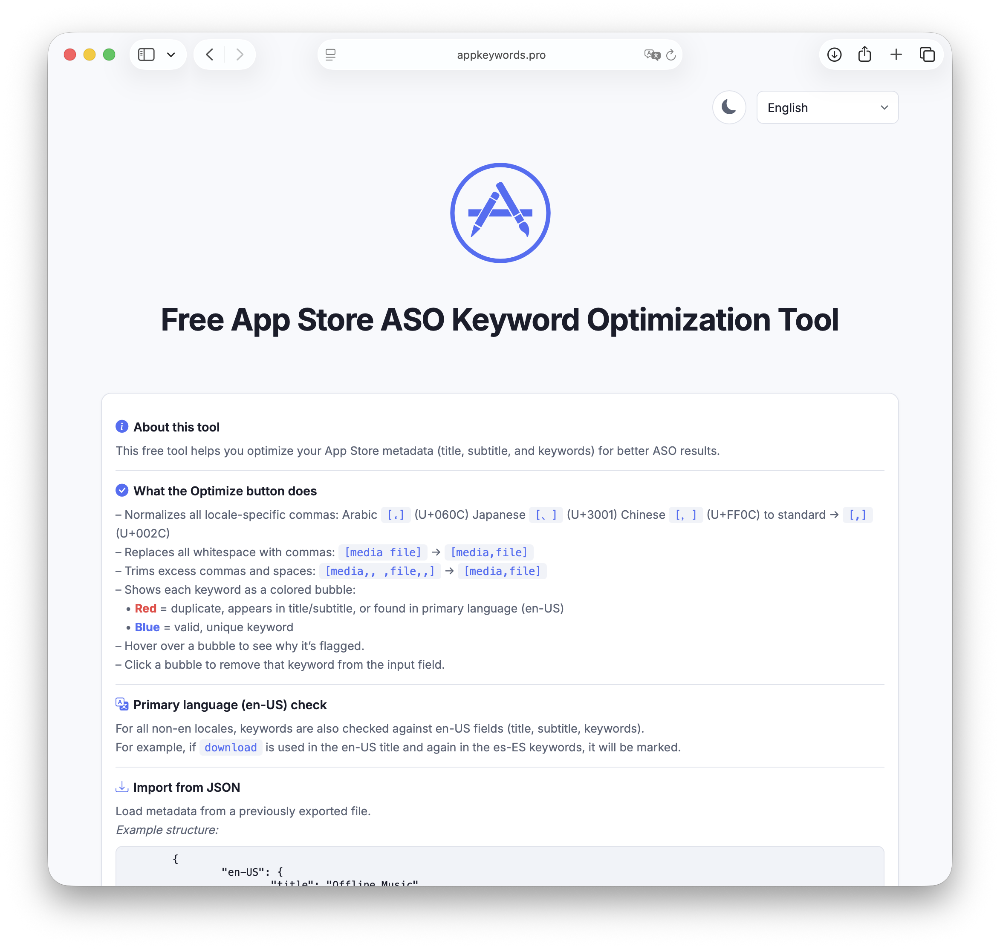

# App Store Keyword Optimizer

🔗 **Live site**: [https://appkeywords.pro](https://appkeywords.pro)



A lightweight web-based tool to help iOS developers optimize their App Store metadata (title, subtitle, keywords). Built with Bootstrap and vanilla JavaScript, it features:

- ✅ Live character counters with validation  
- ✅ Keyword bubbles with visual feedback (used/duplicate vs. valid)  
- ✅ Tooltip explanations for invalid keywords  
- ✅ Fully GitHub Pages–friendly (no backend)

## 🚀 Getting Started

1. Clone or fork the repo:
   ```bash
   git clone https://github.com/YOUR_USERNAME/app-store-keyword-optimizer.git
   ```

2. Open `index.html` in your browser — no build step needed.

3. Or host it via GitHub Pages:

   • Go to your repo > **Settings** > **Pages**  
   • Set the source to your main branch `/ (root)`  
   • Your tool will be live at `https://your-username.github.io/app-store-keyword-optimizer`  
   • Or just use: [https://appkeywords.pro](https://appkeywords.pro)

## ✨ Features

• Clean UI using Bootstrap 5  
• Real-time feedback on keyword limits (30/30/100)  
• Tooltip explanations for:  
  • Duplicates  
  • Title/subtitle matches  
• Keyword cleanup (removes whitespace & duplicates)

## 🧠 Ideal For

• Indie iOS developers  
• ASO specialists  
• Teams optimizing metadata for better search visibility

## 🛠 Scripts for Metadata Import/Export

We’ve added a new `scripts` folder with helper Bash utilities to simplify import/export of App Store metadata to/from JSON format. These are ideal if you're using **Fastlane**.

> 📌 Place the scripts in the same directory that contains your `fastlane/` folder.

### 🔄 `meta_to_json_dict.sh`

Exports metadata from Fastlane's folder structure into a single JSON file (`metadata_output_dict.json`).

**Example Output:**
```json
{
  "en-US": {
    "title": "MyApp: Docs Editor",
    "subtitle": "change & find missing metadata",
    "keywords": "metadata,editor,tags,playlist,audio,track,rename,volume,bitrate,cover,organizer,cloud,support,artist,composer"
  }
}
```

### 🔁 `json_dict_to_meta.sh`

Takes `metadata_output_dict.json` and writes back the localized values into their respective Fastlane folders:

```bash
fastlane/metadata/en-US/name.txt
fastlane/metadata/en-US/subtitle.txt
fastlane/metadata/en-US/keywords.txt
```

---

## 📝 License

MIT — use freely, contribute if you’d like!